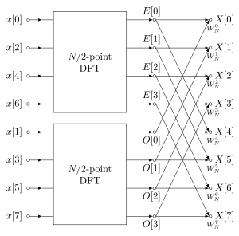

# ASSD TP #2
Grupo #5 | Integrantes:
- Casas, Agustín
- Dalzotto, Rafael
- Fisher, Agustín
- Oms, Mariano Alejandro

## FFT (Precalentamiento)
Implementación en C de la FFT usando el algoritmo de Cooley-Tukey. Específicamente, la implementación es radix-2 DIT (decimation-in-time). Es la opción mas común (y muy optimizada) para implementar la FFT.

### Uso
En caso de que no sirva el ejecutable que está en `FFT/`, compilar usando el comando `make`. El programa en `main.c` define una senal mediante un arreglo de puntos y escribe la salida como arreglo de números complejos en forma binomial en `fft_output.txt`.

## Sintetizador de MIDI en Python

 Es necesario tener instalado los 'development headers' de PortAudio
 El paquete para Linux es `portaudio19-dev`