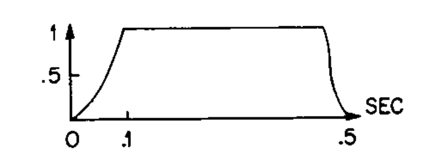

# ASSD TP #2
Grupo #5 | Integrantes:
- Casas, Agustín
- Dalzotto, Rafael
- Fisher, Agustín
- Oms, Mariano Alejandro

# FFT
### Implementacion en C
Para la implementacion en C del algoritmo de la FFT se eligio usar el algoritmo de Cooley-Tukey con Decimation-in-Time (DIT). La implementacion en sencilla.

```C
void fft(complex float* in, complex float* out, size_t n){
    if(n == 1){
        out[0] = in[0];
        return;
    }

    // Split into the DIT FFTs
    complex float* even = malloc(n/2 * sizeof(complex float));
    complex float* odd = malloc(n/2 * sizeof(complex float));

    for(size_t i = 0; i < n/2; i++){
        even[i] = in[2*i];
        odd[i] = in[2*i+1];
    }

    complex float* even_out = malloc(n/2 * sizeof(complex float));
    complex float* odd_out = malloc(n/2 * sizeof(complex float));

    fft(even, even_out, n/2);
    fft(odd, odd_out, n/2);
    
    // Join the results and apply twiddle factors
    for(size_t i = 0; i < n/2; i++){
        // Compute twiddle
        complex float twiddle = cexp(-2 * M_PI * I * i / n) * odd_out[i];
        // Butterfly operation: X[k] = E[k] + W_N^k * O[k]
        out[i] = even_out[i] + twiddle;
        out[i + n/2] = even_out[i] - twiddle;
    }
    
    free(even);
    free(odd);
    free(even_out);
    free(odd_out);
}
```

### Comparacion con numpy.fft.fft()
A traves de un breve script en Python se compila y ejecuta el codigo de C, editando el numero de muestras y tomando todos los puntos de la entrada y salida del codigo de C. Usando `numpy.fft.fft()`.

```Python
import numpy as np
import matplotlib.pyplot as plt
import os

# Set number of samples
N = 512

# Compile and run the C program
os.system(f'cd FFT && make clean && make N={N} && ./main')

# Read in FFT values from the C program
fft_c = np.loadtxt('FFT/fft_output.txt', dtype=complex)

# Fetch the input sine wave from the C program
sine = np.loadtxt('FFT/fft_input.txt')
fft_py = np.fft.fft(sine)

# Plot both FFTs
plt.plot(np.abs(fft_py), label='Python')
plt.plot(np.abs(fft_c), label='C')
plt.legend()
plt.show()
```

Para una entrada con la forma $\sin(80\pi t/N) + 0.5\sin(180\pi t/N)$ y `N = 128` el programa arroja el siguiente grafico.
<p align="center">
  
</p>

Es interesante ver lo que pasa si `N` toma un valor que no es potencia de 2.

<p align="center">
  
</p>

Se ve que el resultado no esta alejado del correcto. Sin embargo se pierde mucha resolucion. Hay picos donde deberian estar pero el espectro esta contaminado y los picos no llegan a tener la amplitud que deberian tener.

# Sintesis por Modelado Fisico con Karplus-Strong
En este trabajo se utilizo modelado fisico para sintesis de cuerdas de Karplus-Strong para sintetizar el sonido de una guitarra acustica.

<p align="center">
  
</p>

Este es el diagrama de bloques basico propuesto por Karplus y Strong.

El algoritmo funciona tomando, primero, una muestra de ruido. Este ruido puede tener diferentes distrubuciones, esto se analizara mas adelante. Luego esa secuencia inicial de ruido pasa por una linea de retardo de longitud $L$, que es la longitud del arreglo. Esto simula la longitud de la cuerda de la guitarra. Esta senal es realimentada a traves de un filtro que tiene la siguiente forma
$$y(t) = 0.5(y(t-L) + y(t-L-1))$$

Esto suaviza la senal y permite que los armonicos mas altos decaigan rapidamente, como en una cuerda real.

La frecuencia de la nota generada tiene la siguiete expresion 
$$f = \frac{f_s}{L+\frac{1}{2}}$$

El sistema tiene transferencia
$$H(z) = \frac{ 1 + z^{-1} }{2 - R_Lz^{-L} - R_L z^{-(L+1)}}$$


# Modulación FM

La modulación en frecuencia es una técnica conocida y aplicada en comunicación por radio por ejemplo. La fórmula general de la FM viene dada por:

$$f(t) = A(t)\cdot sin(\omega_c t + I(t) sin(\omega_m t))$$

donde $\omega_c$ es la frecuencia de la portadora (carrier) (en $\frac{rad}{s}$) y  $\omega_m$ la frecuencia de la modulante. $I(t)$ es el índice de modulación, que da una medida de qué tanto se desvía la frecuencia instantánea de la portadora respecto a su valor original. Se define como $I = \frac{d}{\omega_m}$, donde $d$ es el desvío máximo de la frecuencia instantánea. Por supuesto que si $I(t) = 0$ se tiene una onda senoidal sin desvío, escalada por $A(t)$. 

En cuanto al espectro, si $I > 0$, se tienen componentes en frecuencia al rededor de la frecuencia de la portadora, separadas por $\omega_m$ exactamente, y dependiendo del valor de $I$ cada componente tendrá distinta amplitud, y además el espectro tendrá un mayor ancho de banda mientras $I$ sea mayor. Una aproximación al ancho de banda es:
$$BW \approx 2\cdot (d+\omega_m) = 2\cdot\omega_m \cdot(I+1)$$

Las amplitudes de las componentes se pueden obtener de expresar a la onda mediante el uso de una expansión trigonométrica:

$$
\begin{align*}
f(t) = & \; A\cdot \{ \; \cdot J_0(I) \cdot \sin(\omega_c t) \\
       & \; + J_1(I) \cdot [\sin((\omega_c + \omega_m) t) - \sin((\omega_c - \omega_m) t)] \\
       & \; + J_2(I) \cdot [\sin((\omega_c + 2\omega_m) t) + \sin((\omega_c - 2\omega_m) t)] \\
       & \; + J_3(I) \cdot [\sin((\omega_c + 3\omega_m) t) - \sin((\omega_c - 3\omega_m) t)]\\
       & \; + J_4(I) \cdot [\sin((\omega_c + 4\omega_m) t) + \sin((\omega_c - 4\omega_m) t)]\\
       &\; +  .... \}
\end{align*}
$$


Donde $J_i(I)$ son las funciones de Bessel de primera especie, ¡y vienen en función del índice de modulación! A continuación se presentan algunas de las funciones de Bessel:

<p align="center">
  
</p>

Se realizó mediante Python una FM con $f_c = 4950 Hz$ y $f_m = 330 Hz$ donde se varió el índice de modulación. Para el caso de $I=1$ se tiene:

<p align="center">
  
</p>

y con $I=5$ :

<p align="center">
  
</p>
Como puede observarse, a medida que el índice de modulación incrementa, la potencia de la señal se repartirá entre más armónicos. La amplitud de los armónicos coincide con las funciones de Bessel vistas previamente, y no siempre la frecuencia portadora tendrá la mayor amplitud. Además, las funciones de Bessel pueden ser negativas, lo que conlleva a un cambio en la fase de $180^\circ$, que por lo general se ignora cuando se grafica el espectro, pero es de suma importancia para el método de sintesis de FM. 


## Reflexiones

Cuando se trabaja con una frecuencia portadora cercana a la modulante, o con un índice de modulación muy alto, se tienen componentes de las bandas laterales del espectro que caen en las frecuencias negativas, y esto hace que se "reflejen" respecto de $0 Hz$ y caigan en el lado positivo del espectro, lo que puede pensarse como una especie de aliasing por el lado negativo del espectro. Al reflejarse, si coinciden en frecuencia con alguna otra componente, se mezclan, y dependiendo del signo que lleven, se suman o restan. Al espejarse se obtiene un desfasaje extra de $180^\circ$, por lo que hay que considerar el desfasaje previo, que dicta si se resta o se suma.

## Espectro Armónico
Se dan propiedades interesantes cuando la relación de frecuencia portadora a modulante es un cociente de números enteros, es decir

$$\frac{\omega_c}{\omega_m} = \frac{N_1}{N_2}$$

siendo una fracción irreducible. En ese caso, la frecuencia fundamental será 

$$\omega_0 = \frac{\omega_c}{N1} = \frac{\omega_m}{N2} \$$

Es importante que el cociente sea el indicado, ya que de ser irracional, el sonido generado es totalmente diferente y no agradable para el oído.

Si además se considera que $I$ depende del tiempo, es decir $I = I(t)$, se puede variar el espectro en el tiempo, y con esto se puede sintetizar el espectro de los instrumentos. Encontrar la función $I(t)$ es complicado, y mediante prueba y error es algo tedioso, así como encontrar el cociente indicado $\frac{N_1}{N_2}$. Por este motivo se investigó en la literatura para encontrar dichos parámetros.

## Envolventes

Se encontró que las funciones $A(t)$ e $I(t)$ pueden ser modeladas mediante ADSR, pero para instrumentos de viento, éstas funciones son muy particulares, siendo:


<p align="center">
  
</p>

la forma normalizada de la función $A(t)$. Y la forma normalizada del índice de modulación es:

<p align="center">
  
</p>

Si se necesita que el índice de modulación comience en un valor mayor al que termina, la última función será restada al índice de modulación inicial.

## Implementación

Ahora que se tienen las formas de las funciones, es hora de darle vida a los instrumentos. Según el paper 1 de la bibliografía, para generar el sonido de un clarinete, los parámetros son:

- $f_c = 3\cdot f_0$    
- $f_m = 2\cdot f_0$ 
- $I_1 = 4$
- $I_2 = 2$

es decir que la frecuencia de la portadora es $3$ veces la central de la nota, y la modulante es dos veces la central. Además, el índice de modulación comienza en $4$ y termina en $2$, por lo que como mencionamos, al inicial se le restará la función de la anterior figura para que llegue a $2$. Sin embargo, empíricamente se comprobó que las notas sintetizadas no coincidían con las verdaderas del clarinete, por lo que ajustando $N_1$ y $N_2$, sin modificar el cociente (que debe ser $\frac{3}{2}$), se llegó a un resultado mucho más parecido a un clarinete real, comparándose con las notas del siguiente video [Notas del clarinete](https://www.youtube.com/watch?v=uisOCi99qd0). Dicho ajusté llevó a los siguientes parámetros

- $f_c = 1.365\cdot f_0$    
- $f_m = 0.91\cdot f_0$ 
- $I_1 = 4$
- $I_2 = 2$

donde se tiene que la relación está intacta.

Para por ejemplo producir un sonido parecido al de un fagot (basoon), los parámetros son:

- $f_c = 5\cdot f_0$    
- $f_m = 1\cdot f_0$ 
- $I_1 = 0$
- $I_2 = 1.5$


# Modulación DFM

Por otro lado, se investigó otra forma de modular en frecuencia, que usa en vez de una frecuencia de portadora fija y un seno modificando la frecuencia instantánea, se tienen dos senoidales con un índice de modulación fijo, es decir

$$f(t) = A(t)\cdot sin(I_1(t) sin(\omega_1 t) + I_2(t) sin(\omega_2 t))$$

Esta forma de modular se llama Double Frequency Modulation, (DFM), y es una alternativa mucho más ligera en cálculo que la Asymmetrical Frequency Modulation, que agrega un parámetro extra a la FM normal y permite que el espectro no sea simétrico. La DFM se puede expresar como:

$$f(t) = A(t) \sum_i \sum_k J_i(I_1) J_k(I_2)sin(iw_1t + kw_2t)$$

Lo cual por supuesto vuelve mucho más complejo el cálculo a mano del espectro. Por suerte, en el [paper](https://phyweb.physics.nus.edu.sg/~phytanb/automatedparameter.pdf) 2 se utiliza un algoritmo annealing para estimar los parámetros que se utilizan para sintetizar los instrumentos. Además, si se suman varias DFM, es decir $f(t) = f_1(t) + f_2(t) + f_3(t)$ se logra una aproximación mucho mejor al espectro del instrumento. Como envolvente (A(t)) se utilizó la función anterior, y además, cada $f_i(t)$ tiene su propio "peso" para aportar apropiadamente las componentes necesarias. Los parámetros para algunos de los instrumentos sintetizados son:


donde se muestra cada amplitud (peso relativo), índice de modulación 1 y 2, y la frecuencia de cada senoidal que acompaña al índice. 
Para extrapolar a otras notas (ya que esto es para una frecuencia de $440 Hz$), se divide cada frecuencia por $440$ y ese será el multiplicador para la frecuencia de la nota, así se logra sintetizar cada nota.
Además, en la figura se aprecia el grado de concordancia de la respuesta del algoritmo con el espectro de la nota obtenida de una muestra. 

Otros ejemplos de parámetros son:


# Implementación
En Python, se realizaron dichos algoritmos mediante el uso de funciones de numpy como el sin() y las envolventes se fabricaron mediante combinaciones de funciones del estilo.

Por otro lado, todos los parámetros de los instrumentos son modificables durante la ejecución del programa, sin la necesidad de volver a compilar, aunque tienen un valor por defecto al iniciar el programa, que se considera el valor óptimo, para que luego el usuario modifique a gusto dichas variables. Se pueden modificar cosas como el tiempo de ataque de la envolvente o de la I(t), los parámetros $N_1$, $N_2$, etc.

Los instrumentos sintetizados (con su respectivo método) fueron:

- Clarinete (FM)
- Fagot/Basoon (FM)
- Saxofón (DFM)
- Oboe (DFM)
- Trompa Francesa (DFM)
- Clavicordio/Harpsichord (DFM)
- Órgano (DFM)
- Trompeta (DFM)

El clavicordio, al ser un instrumento de cuerda, debe cambiarse la envolvente para que tenga un attack rápido, sin sustain y solo se tenga decay, de la siguiente forma:


El órgano sin embargo no suena de forma adecuada, por lo que se piensa que agregando efectos como flanger puede llegarse a una sintetización más coincidente con la realidad.


# Síntetis por Muestras

Para realizar la síntesis por muestras, primero se obtuvieron algunas muestras de los instrumentos Saxo Tenor, Saxo Soprano y Piano espaciadas en un rango de entre 20 y 100 (nota midi) aproximadamente para piano, con un espaciado intermedio aproximado de 7 notas midi. Para los Saxo se consiguieron muestras de entre 58 y 102 aproxiadamente.

La idea es que el programa precompute las notas intermedias restantes utilizando las muestras más cercanas para no distorsionar tanto el sonido.

Las dos funciones principales son `pitch_shift` y `time_stretch` de la librería [`librosa`, utilizada para música y análisis de audio](https://librosa.org/). Veremos la lógica interna de estas funciones a continuación:

## Time Stretch

La función `time_stretch` en `librosa` cambia la velocidad de una señal de audio sin afectar su tono. Hace esto usando una técnica llamada vocoder de fase. Aquí está una explicación paso a paso de cómo funciona:

1. **Short Time Fourier Transform (STFT)**: La función primero calcula la transformada de Fourier a corto plazo (STFT) del audio de entrada. La STFT es una forma de analizar el contenido de frecuencia de una señal a lo largo del tiempo. Hace esto dividiendo la señal en segmentos temporales y calculando la transformada de Fourier de cada segmento. El resultado es una matriz 2D donde una dimensión representa el tiempo (cada segmento) y la otra dimensión representa la frecuencia para cada segmento temporal. De hecho un espectrograma consiste en hacer una STFT.

2. **Phase Vocoder**: Luego, la función aplica un vocoder de fase al output de la STFT. El vocoder de fase es una técnica para cambiar la velocidad de una señal sin afectar su tono. Hace esto modificando las fases del STFT interpolando información presente en los dominios de frecuencia y tiempo de las señales de audio mediante el uso de la información de la STFT, de manera que preserva las relaciones de fase relativas entre diferentes frecuencias.

3. **STFT inversa**: Luego, la función calcula la STFT inversa del STFT vocoder de fase. La STFT inversa es una forma de convertir de nuevo del dominio de la frecuencia al dominio del tiempo. El resultado es el audio estirado en el tiempo.

## Pitch Shift

1. La función `pitch_shift` en `librosa` realiza un cambio de tono cambiando la velocidad del audio y luego remuestreándolo a la tasa de muestreo original:

1. **Estiramiento de tiempo**: La función primero realiza un estiramiento de tiempo en el audio de entrada usando la función `time_stretch` explicada anteriormente.


2. **Remuestreo**: El audio estirado en el tiempo se remuestrea con la tasa de muestreo original y se hace una interpolación. El remuestreo es el proceso de cambiar la tasa de muestreo de una señal de audio. En este caso, la tasa de muestreo se incrementa si el audio se aceleró y se disminuye si el audio se ralentizó. Esto devuelve la velocidad del audio a su valor original, pero el tono permanece cambiado.

Entonces, en resumen, la función `pitch_shift` cambia el tono del audio acelerándolo o ralentizándolo y luego remuestreándolo a la velocidad original.
  

# Efectos de Audio

En esta sección se va a explicar cada efecto implementado

## Eco Simple

La implentación del eco fue la siguiente

<p align="center">
  
</p>

En donde la función transferencia es $$H(z) = \frac{z^{-\tau}}{1-gz^{-\tau}}$$ al expresar esto como una ecuación en diferencias obtenemos 
$$y(n) = x(n-\tau) + y(n-\tau)g$$
en donde $\tau$ es el tiempo de dealy, este es del tamaño de la señal, y $g$ es la ganancia del lazo de realimentación, este valor debe ser $0 < g < 1$ para que el lazo sea estable. La impletentación en el codigo permite seleccionar la cantidad de repeticiones del eco, expresado en veces. De forma tal que la respuesta al escalón esta dada 

<p align="center">
  
</p>

donde la respuesta al escalon esta dada de la siguiente forma
$$h(n) = \delta(t - \tau) + g\delta(t - 2\tau) + g^2\delta(t - 3\tau) + ... $$

donde esta repetción se da las veces preestablecidas por el usuario.

## Reverberador plano

La implemtentacón de este es similar a la del eco simple, siendo el diagramas de bolques y la función transferencia iguales al caso anterior, la unica diferencia es que el usuario puede selecciónar el tiempo de delay en el cual arranquen las reverberaciones. 

## Reververador por convolución

Este efecto se basa en convolucionar el sonido de entrada con la respuesta al escalón de una habitación, también llamados **RIR**. Al hacer esto se puede simular el sonido en esa habitación.

$$y(n) = (x*h)(n) $$

donde $h(n)$ es una RIR.

## Flanger

La implentación esta basada en el siguiente esquema

<p align="center">
  
</p>

Esta es su ecuación en diferencias

$$y(n) = x(n) + x(n-M(n))g$$

donde $M(n)$ es una senal discreta y periodica, modelada con un **LFO**, (Low Frecuency Oscilator) y $g$ la ganancia. El tiempo de delay va desde 0 $ms$ a 15 $ms$. El usuario puede cambiar la duración del delay, la frecuencia del **LFO**, la tensión DC de base y la ganancia de este delay.

## Chorus

La implementación es similar a la del Flanger, teniendo un diagrama en bloques parecido.

<p align="center">
  
</p>

Es la implementación en paralelo de 4 chorus, donde el delay de cada uno va entre 10 $ms$ y 25 $ms$. La razón por la que se implementan 4 en paralelo es para mejorar el efecto. Su función transferencia es de la siguiente manera

$$y(n) = x(n)g + x(n-M_1(n))g_1 + x(n-M_2(n))g_2 + x(n-M_3(n))g_3 + x(n-M_4(n))g_4$$

Donde $M_n$ es el delay de cada etapa y $g_n$ su respectiva ganancia y $g$ la ganancia del sonido original.

# Control de Amplitud
Al sumar notas, se puede dar el caso de que la amplitud del sea mayor al valor máximo, $\pm 1$, por lo que se debe escalar en dicho caso. El problema es que si se escala el audio en su totalidad, las partes en las que la amplitud era baja pueden ser atenuadas hasta el punto que no sea audible, lo que no es deseable. Lo que se plantea entonces, es utilizar un algoritmo el cual pueda detectar los puntos que estén fuera del valor límite y aplicarles un escalamiento.

## Algoritmo

Se encontró en una patente un algoritmo en el cual se tiene un arreglo de valores, los cuales deben estar limitados entre $C$ y $-C$, y mediante un factor de escala particular para cada posición del arreglo, se se dejan los valores excedentes a $C$ con una amplitud menor o igual a $C$. 

El método consiste en analizar por separado el arreglo, en fragmentos de tamaño N. Se usa además otro arreglo auxiliar que son los M valores que le siguen al fragmento. Se encuentran los valores de los picos de amplitud ($X_1$, $X_2$) y sus índices ($n_1$ , $n_2$), así como las posiciones donde se comienza a sobrepasarse el nivel $C$ ($n_{L1}$  , $n_{L2}$) y donde termina la región en la que se sobrepasa $C$ ($n_{R1}$ , $n_{R2}$). Se tienen entonces distintas secciones del fragmento, tal como se ve en la imagen siguiente

<p align="center">
  
</p>

Para cada una de las secciones se calcula un factor de escala que será función de la posición en el arreglo, y será una recta. Ésta recta dependerá de: qué tanto se pase el valor máximo de $C$, el índice donde comienza a sobrepasarse $C$, entre otros factores, como por ejemplo el factor de escala inicial (el del elemento final de la anterior iteración). Con estas rectas calculadas, se escala el fragmento de tamaño N, y el de M no ya que es solo una referencia para lo que pasará a futuro, y que se pueda ir modificando el factor de escala según se necesite. Una vez terminado con el fragmento de N muestras, se tomarán los elementos a partir del primer elemento del framento de tamaño M y se repetirá el procedimiento. El factor de escala cambia suavemente debido a que un cambio brusco distorsionaría el audio.

Por otra parte, si no se pasa nunca el valor de $C$, el factor de escala será siempre $1$. Si se escaló en algún punto de la señal ciertas posiciones del arreglo y luego no se encuentran más posiciones con amplitud mayor a $C$, el  factor de escala subirá lentamente hasta $1$. Los detalles matemáticos de cómo se calcula cada recta y los distintos casos son explicados excelentemente en la [patente]((https://www.freepatentsonline.com/8208659.pdf)), y el programa fue basado en los procedimientos detallados.


# Bibliografía
- [The Synthesis of Complex Audio Spectra by Means of Frequency Modulation](https://web.eecs.umich.edu/~fessler/course/100/misc/chowning-73-tso.pdf)
- [Automated ParameterOptimization for Double FrequencyModulation Synthesis Using the Genetic Annealing Algorithm](https://phyweb.physics.nus.edu.sg/~phytanb/automatedparameter.pdf)
- [Frecuencia de las notas](https://www.liutaiomottola.com/formulae/freqtab.htm)
- [DIGITAL SYNTHESIS MODELS OF CLARINET-LIKE INSTRUMENTS INCLUDING NONLINEAR LOSSES IN THE RESONATOR](https://www.dafx.de/paper-archive/2006/papers/p_083.pdf)
- [Frequency Modulation Basics](https://www.sfu.ca/~truax/fmtut.html)
- [Digital Synthesis of Musical Sounds](https://alumni.media.mit.edu/~gan/Gan/Education/NUS/Physics/MScThesis/)
- [Real-Time Audio Processing by Means of FM Synthesis Parameters](https://www.researchgate.net/publication/298982542_Audio_Processing_by_Means_of_FM_Synthesis_Parameters_Fundamentals_Real-Time_Implementation_and_Preliminary_Compositional_Applications)
- [WELSH’S SYNTHESIZER COOKBOOK](https://synthesizer-cookbook.com/SynCookbook.pdf)
- [Saxophone acoustics: an introduction](https://www.phys.unsw.edu.au/jw/saxacoustics.html#pff)
- [Basoon First Notes](https://ettonehome.weebly.com/bassoon-first-notes.html)
- [Synthesis of Wind-Instrument Tones](https://physics.byu.edu/docs/publication/2477)
- [Musical aero-acoustics of the clarinet](https://www.researchgate.net/publication/45624695_Musical_aero-acoustics_of_the_clarinet)
- [Method and apparatus for scaling signals to prevent amplitude clipping](https://www.freepatentsonline.com/8208659.pdf)
