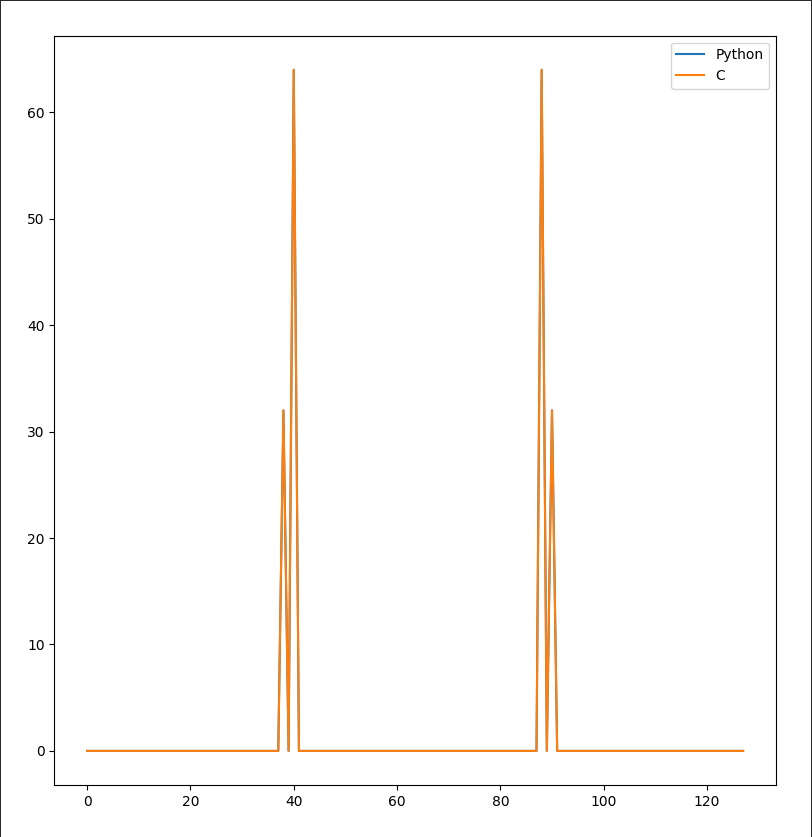

## FFT
### Implementacion en C
Para la implementacion en C del algoritmo de la FFT se eligio usar el algoritmo de Cooley-Tukey con Decimation-in-Time (DIT). La implementacion en sencilla.

```C
void fft(complex float* in, complex float* out, size_t n){
    if(n == 1){
        out[0] = in[0];
        return;
    }

    // Split into the DIT FFTs
    complex float* even = malloc(n/2 * sizeof(complex float));
    complex float* odd = malloc(n/2 * sizeof(complex float));

    for(size_t i = 0; i < n/2; i++){
        even[i] = in[2*i];
        odd[i] = in[2*i+1];
    }

    complex float* even_out = malloc(n/2 * sizeof(complex float));
    complex float* odd_out = malloc(n/2 * sizeof(complex float));

    fft(even, even_out, n/2);
    fft(odd, odd_out, n/2);
    
    // Join the results and apply twiddle factors
    for(size_t i = 0; i < n/2; i++){
        // Compute twiddle
        complex float twiddle = cexp(-2 * M_PI * I * i / n) * odd_out[i];
        // Butterfly operation: X[k] = E[k] + W_N^k * O[k]
        out[i] = even_out[i] + twiddle;
        out[i + n/2] = even_out[i] - twiddle;
    }
    
    free(even);
    free(odd);
    free(even_out);
    free(odd_out);
}
```

### Comparacion con numpy.fft.fft()
A traves de un breve script en Python se compila y ejecuta el codigo de C, editando el numero de muestras y tomando todos los puntos de la entrada y salida del codigo de C. Usando `numpy.fft.fft()`.

```Python
import numpy as np
import matplotlib.pyplot as plt
import os

# Set number of samples
N = 512

# Compile and run the C program
os.system(f'cd FFT && make clean && make N={N} && ./main')

# Read in FFT values from the C program
fft_c = np.loadtxt('FFT/fft_output.txt', dtype=complex)

# Fetch the input sine wave from the C program
sine = np.loadtxt('FFT/fft_input.txt')
fft_py = np.fft.fft(sine)

# Plot both FFTs
plt.plot(np.abs(fft_py), label='Python')
plt.plot(np.abs(fft_c), label='C')
plt.legend()
plt.show()
```

Para una entrada con la forma $\sin(80\pi t/N) + 0.5\sin(180\pi t/N)$ y `N = 128` el programa arroja el siguiente grafico.
<p align="center">
  
</p>

Es interesante ver lo que pasa si `N` toma un valor que no es potencia de 2.

<p align="center">
  
</p>

Se ve que el resultado no esta alejado del correcto. Sin embargo se pierde mucha resolucion. Hay picos donde deberian estar pero el espectro esta contaminado y los picos no llegan a tener la amplitud que deberian tener.

## Sintesis por Modelado Fisico con Karplus-Strong
En este trabajo se utilizo modelado fisico para sintesis de cuerdas de Karplus-Strong para sintetizar el sonido de una guitarra acustica.

<p align="center">
  
</p>

Este es el diagrama de bloques basico propuesto por Karplus y Strong.

El algoritmo funciona tomando, primero, una muestra de ruido. Este ruido puede tener diferentes distrubuciones, esto se analizara mas adelante. Luego esa secuencia inicial de ruido pasa por una linea de retardo de longitud $L$, que es la longitud del arreglo. Esto simula la longitud de la cuerda de la guitarra. Esta senal es realimentada a traves de un filtro que tiene la siguiente forma
$$y(t) = 0.5(y(t-L) + y(t-L-1))$$

Esto suaviza la senal y permite que los armonicos mas altos decaigan rapidamente, como en una cuerda real.

La frecuencia de la nota generada tiene la siguiete expresion $$f = \frac{f_s}{L+\frac{1}{2}}$$

El sistema tiene transferencia $$H(z) = \frac{ 1 + z^{-1} }{2 - R_Lz^{-L} - R_L z^{-(L+1)}}$$